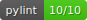
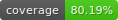

# model-training



This repository contains the machine learning training pipeline for a sentiment classification model based on restaurant reviews. It is inspired by the GitHub repository: [proksch/restaurant-sentiment](https://github.com/proksch/restaurant-sentiment).

The training pipeline performs the following steps:

1. Downloads the dataset in `.tsv` from the sentiment-analysis repo in `get_data.py`.
2. Loads the labelled dataset in `.tsv` format containing restaurant reviews.
3. Preprocesses the data using methods from the `lib-ml` package in `preprocess.py`.
4. Trains a Naive Bayes classifier in `train.py`.
5. Saves the trained model locally to `model/model.pkl`.
6. Evaluates the trained model in `eval.py`.
7. Publishes a versioned model artifact to **GitHub Releases**.
8. Tracks data, metrics, and models using DVC with a Google Cloud Storage remote.


## Training Data
The dataset is loaded into the `/data` folder in `.tsv` format and is downloaded (at run-time) from:
🔗 [https://github.com/proksch/restaurant-sentiment](https://github.com/proksch/restaurant-sentiment)


## Local Setup
**Requirements:**
* Python `3.12.3`
* `pip`
* dvc[gs] (already included in `dev-requirements.txt`)

**Setup Virtual Environment:**
Run the following command from the project root:
```bash
python -m venv <venv_name>
source <venv_name>/bin/activate  # For Unix/macOS
# Or use <venv_name>\Scripts\activate on Windows

pip install . 
# Or for development code
pip install -r dev-requirements.txt
```

To deactive after use:
```bash
deactivate
```

**Run Training Pipeline Manually:**
Run the following commands from the project root:
```bash
python model-training/restaurant_sentiment/get_data.py
python model-training/restaurant_sentiment/preprocess.py
python model-training/restaurant_sentiment/train.py
# For evaluation:
python model-training/restaurant_sentiment/eval.py
```


## Model Release
To publish a trained model to GitHub Releases, create a version tag using semantic versioning:
```bash
git tag v<MAJOR>.<MINOR>.<PATCH>
git push origin v<MAJOR>.<MINOR>.<PATCH>
```

This will trigger the `release.yml` GitHub Actions workflow, which trains the model and uploads it as an artifact to GitHub Releases. Once published, model releases are publicly accessible. For example, the download link for version `v0.1.0` would be:
[https://github.com/remla25-team6/model-training/releases/download/v0.1.0/model-v0.1.0.pkl](https://github.com/remla25-team6/model-training/releases/download/v0.1.0/model-v0.1.0.pkl)

## DVC Integration (with Google Cloud Storage)
### Setup (First-Time Only)
1. Follow the instructions above to create a virtual environment and install dependencies for local development from `dev-requirements.txt`.
2. Add your Google Cloud Storage (GCS) key in the form `keyfile.json` to the root directory.
2. Export your GCS key path from the root directory:
```bash
export GOOGLE_APPLICATION_CREDENTIALS=keyfile.json
```
3. Pull all data and models tracked by DVC:
```bash
dvc pull
```

### Reproduce Full Pipeline
```bash
dvc repro
```
DVC will run only the necessary stages in order: `get_data → preprocess → train → eval`.

### Rollback to Past Versions
To roll back to a specific previous version:
```bash
# Go to a previous Git commit (where metrics/data were different)
git checkout <commit_hash>

# Restore the corresponding data and model artifacts
dvc checkout
```
You can find commit hashes from:
```bash
dvc exp show
```

### Run and Compare Experiments
You can create and track experiments using DVC's experiment tools:
```bash
# Run an xxperiment
dvc exp run

# Test a different parameter (e.g., random state)
# # See params.yaml for all configurable parameters
dvc exp run --set-param train.random_state=20

# Show all experiments
dvc exp show
```

### Metrics Tracking
The `model/metrics.json` file includes:
- `test_accuracy`
- `test_precision`
- `test_recall`
- `test_f1_score`
- `test_cohens_kappa`
- `test_samples`
You can compare metrics from different experiments using DVC's experiment and metrics tools:
```bash
# Compare experiments
dvc exp show

# Compare specific experiments 
dvc exp diff <exp1> <exp2>

# Compare metric differences
dvc metrics diff
```

### Push to Remote
To share data and metrics to remote, after running or reproducing the pipeline:
```bash
dvc push
```
To share experiments:
```bash
dvc exp push origin <exp_id>
```
To apply the best experiment:
```bash
dvc exp apply <exp_id>
git commit -am "<commit_message>"
```

## Google Cloud Storage Access Setup
### For Developers: Using `keyfile.json` to Authenticate
1. Go to [Google Cloud Console](https://console.cloud.google.com) → [IAM & Admin](https://console.cloud.google.com/iam-admin/) → [Service Accounts](https://console.cloud.google.com/iam-admin/serviceaccounts).
2. To securely access the DVC remote (stored in Google Cloud Storage), all users use the shared service account which you should see listed:
```bash
dvc-access@remla25-team6.iam.gserviceaccount.com
```
3. Click on the shared service account.
4. Create a new key through "Keys → Add Key → Create New Key → Json". This will download a JSON keyfile.
5. Copy the keyfile as `keyfile.json` to the project root directory.
6. Set the environment variable. In your terminal at the root directory:
```bash
export GOOGLE_APPLICATION_CREDENTIALS=keyfile.json
```
7. Now you can run DVC commands.

### For Administrators: Creating and Managing Access
To add new users to the project:
1. Go to [Google Cloud Console](https://console.cloud.google.com) → [IAM & Admin](https://console.cloud.google.com/iam-admin/).
2. Click “Grant Access”.
3. Enter the user’s email address.
4. Assign a role such as:
    - `Storage Object Viewer` (read-only)
    - `Storage Object Admin` (read/write)
5. Click Save.

## AI Disclaimer
This documented was refined using ChatGPT 4o.